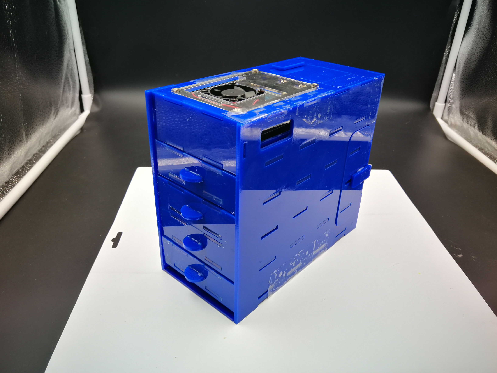
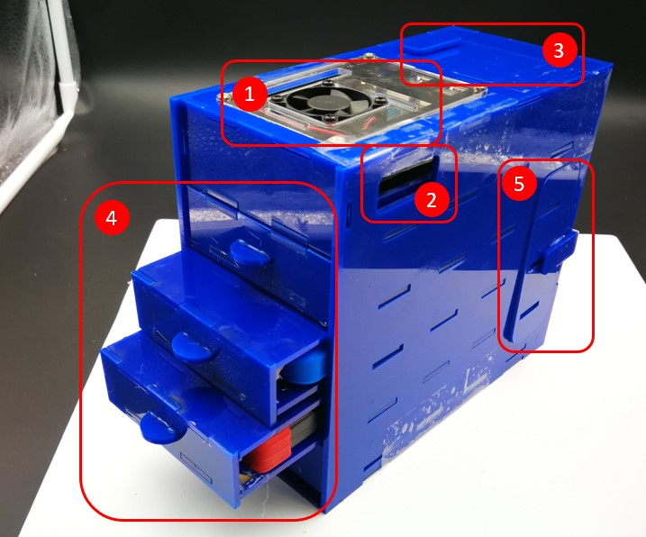

# Self-build_NAS_Server

## Content 

- 1 Overview and introduction
- 2 The hardware setup
- 3 The software setup

## 1 Overview and introduction

The functionality of this self-build NAS server is shown as bellow:

1. The place where you can put a Raspberry Pi 4 with a [acrylic case](https://www.amazon.com/gp/product/B07WQWTZSD)

2. This is the place where you can plug power wire in to the Raspberry Pi
3. This is the place where you can open the cover and plug the HDD drive USB wires into Raspberry Pi
4. The HDD mobile drive drawer. You can install 4 HDD drive in total
5.  This is the place where you can open the cover and unplug the USB connection wires from your HDD mobile drive

## 2 The hardware setup

To build up such a server by yourself, you need to have the following hardware:

- [Raspberry Pi 4](https://www.amazon.com/LANDZO-Raspberry-Pi-Model-8gb/dp/B08R87H4RR)
- [16 G TF card](https://www.amazon.com/KEXIN-Micro-MicroSDHC-UHS-I-Memory/dp/B07XHQ5DTN)
- [Raspberry Pi power supply](https://www.amazon.com/gp/product/B07TSFYXBC)  
- [Mobile HDD](https://www.amazon.com/gp/product/B06W55K9N6) , choose the storage size as needed
- [Raspberry Pi 4 acrylic case](https://www.amazon.com/gp/product/B07WQWTZSD)
- Server acrylic case that integrates everything

